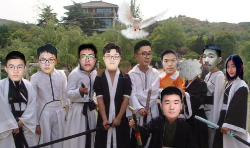

# 这座城市多了十只伤心的鸽——团队展示
| 这个作业属于哪个课程 | [2021春软件工程实践\|W班 (福州大学)](https://edu.cnblogs.com/campus/fzu/2021SpringSoftwareEngineeringPractice) |
| --- | --- |
| 这个作业要求在哪里 | [团队作业一](https://edu.cnblogs.com/campus/fzu/2021SpringSoftwareEngineeringPractice/homework/11848) |
| 团队名称 | 这座城市多了十只伤心的鸽 |
| 这个作业的目标 | 确定团队及选题 以NABCD模型分析选题 拟定团队考核方案|
| 参考文献 | 《构建之法》 |

[toc]

## 1、团队队名

**这座城市多了十只伤心的鸽···**
(虽然是鸽子，但绝不咕咕咕)

##  2、团队项目描述

“志愿信鸽”是一个主要应用于党建工作中的党员志愿服务及任务统计的微信端小程序。

## 3、队员风采

（排序不分先后）

| 学号 | 221801311 |
| --- | --- |
| **成员姓名** | 郭晗宇 |
| **博客园地址** | [https://www.cnblogs.com/guohanyu/](https://www.cnblogs.com/guohanyu/) |
| **性格** | ？？？ |
| **擅长的技术** | 前端开发 |
| **兴趣爱好** | 打游戏 |
| **希望的软工角色** | 前端 |
| **一句slogan** | ？？？？？ |

---

| 学号 | 221801129 |
| --- | --- |
| **成员昵称** | PY |
| **博客园地址** | [https://www.cnblogs.com/arturia-py](https://www.cnblogs.com/arturia-py) |
| **性格** | 懒 |
| **擅长的技术** | 划水 |
| **兴趣爱好** | 球、番、游 |
| **希望的软工角色** | 后端吧 |
| **一句slogan** | 划！ |

---

| 学号 | 221801320 |
| --- | --- |
| **成员昵称** | 罗德尼鸽 |
| **博客园地址** | [https://www.cnblogs.com/luogugu/](https://www.cnblogs.com/luogugu/) |
| **性格** | 乐观、跳脱、间歇性惆怅。 |
| **擅长的技术** | 项目管理、进度监管、原型设计 |
| **兴趣爱好** | 桌游、阅读。 |
| **希望的软工角色** | PM |
| **一句slogan** | 按时提交就算成功（划掉） |

---

| 学号 | 221801102 |
| --- | --- |
| **成员姓名** | 唐德宇 |
| **博客园地址** | [https://www.cnblogs.com/nosae/](https://www.cnblogs.com/nosae/) |
| **性格** | 自信 |
| **擅长的技术** | Android、golang |
| **兴趣爱好** | 逛街 |
| **希望的软工角色** | 后端 |
| **一句slogan** | share memory by communicating！ |

---

| 学号 | 221801213 |
| --- | --- |
| **成员昵称** | Guodd |
| **博客园地址** | [https://www.cnblogs.com/guodd/](https://www.cnblogs.com/guodd/) |
| **性格** | 不明 |
| **擅长的技术** | 摸鱼 |
| **兴趣爱好** | 睡觉，运动 |
| **希望的软工角色** | PM |
| **一句slogan** | happycoding |

---

| 学号 | 221801221 |
| --- | --- |
| **成员昵称** | 吃蛋挞 |
| **博客园地址** | [https://www.cnblogs.com/GONGHAIXU/](https://www.cnblogs.com/GONGHAIXU/) |
| **性格** | 懒惰 |
| **擅长的技术** | 后端 |
| **兴趣爱好** | 摸鱼 |
| **希望的软工角色** | 后端 |
| **一句slogan** | 这个真的需要吗？ |

---

| 学号 | 221801107 |
| --- | --- |
| **成员昵称** | Huro |
| **博客园地址** | [https://home.cnblogs.com/u/huro](https://home.cnblogs.com/u/huro) |
| **性格** | (发掘中...) |
| **擅长的技术** | 前端 |
| **兴趣爱好** | 毛绒绒 |
| **希望的软工角色** | 前端 |
| **一句slogan** | 额 |

---

| 学号 | 221801313 |
| --- | --- |
| **成员姓名** | 方燮楠 |
| **博客园地址** | [https://www.cnblogs.com/tonysken/](https://www.cnblogs.com/tonysken/) |
| **性格** | 一般 |
| **擅长的技术** | python mysql redis |
| **兴趣爱好** | 踢球 |
| **希望的软工角色** | 后端 |
| **一句slogan** | 一只鸽子 |

---

| 学号 | 221801306 |
| --- | --- |
| **成员昵称** | Elsa1226 |
| **博客园地址** | [https://www.cnblogs.com/Elsa1226/](https://www.cnblogs.com/Elsa1226/) |
| **性格** | 我说我是萌妹你信吗 |
| **擅长的技术** | java |
| **兴趣爱好** | 摸鱼 |
| **希望的软工角色** | 后端 |
| **一句slogan** | 湖人总冠军 |

---

| 学号 | 291800139 |
| --- | --- |
| **成员昵称** | Recii |
| **博客园地址** | [https://www.cnblogs.com/recii/](https://www.cnblogs.com/recii/) |
| **性格** | 能说能笑、能吃能睡 |
| **擅长的技术** | 码字、稍稍画点图 |
| **兴趣爱好** | 刷剧、听歌、阅读 |
| **希望的软工角色** | PM |
| **一句slogan** | 和大佬共事1.0--好好学习 |

## 4、团队首次合照

## 5、团队绩效考核方案

### 业绩考核表
| 评判类型 | 关键业绩指标 | 权重 |
| --- | --- | --- |
| 会议讨论 | 会议是否按时参加（出勤出勤出勤！）| 10 |
|  | 阶段性目标是否实现（一步一脚印） | 15 |
|  | 有问题是否及时公开（有效的交流和讨论） | 10 |
| 单独作业 | 工作完成及时率（别咕了）| 10 |
|  | 设计方案采用率（每个人都有自己的脑洞） | 10 |
|  | 工作质量（质量才是硬道理） | 30 |
|  | 技术资料是否及时归档（整理复盘同样很重要） | 10 |

### 态度考核表
| 指标名称 | 考核标准 |
| --- | --- |
| 优 |  | 良 |  | 中 |  |
| 标准 | 得分 | 标准 | 得分 | 标准 | 得分 |
| 工作责任心 | 强烈 | 30 | 有 | 15 | 一般 | 7 |
| 工作积极性 | 非常高 | 25 | 高 | 12 | 一般 | 6 |
| 团队意识 | 强烈 | 25 | 有 | 12 | 一般 | 6 |
| 学习意识 | 强烈 | 20 | 有 | 10 | 一般 | 5 |

## 6、团队愿景

- 我们希望能够将这个项目的各项功能全部完成，小程序能够正常使用，能够满足绝大多数人各个时期的入党志愿服务的报名、统计、后续跟进等需求。我们计划采用高并发技术来应对较大的使用量，保障用户体验和小程序的正常运行。
- 同时采用运营式开发模式，在投入使用之后根据用户的反馈提供针对性研发以及后续服务。最后，希望团队成员能够在这段时间内在各个方面都有长足的进步。
