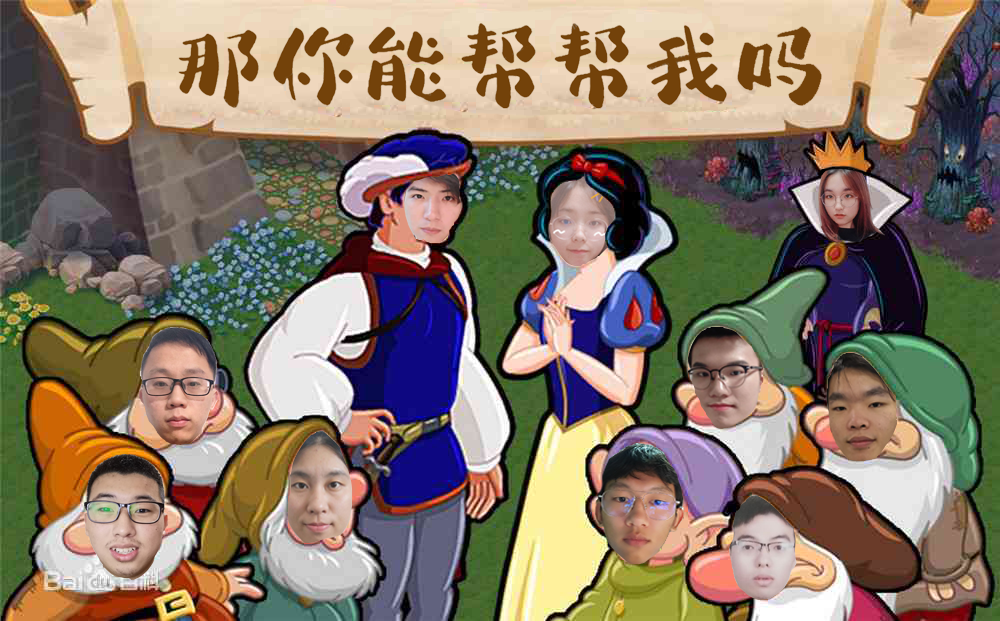
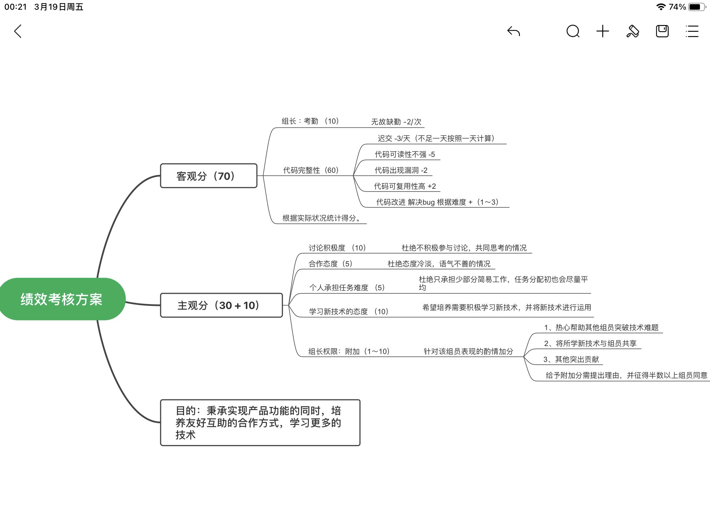

## 那你能帮帮我吗——团队展示
|这个作业属于哪个课程|[2021春软件工程实践\|W班(福州大学)](https://edu.cnblogs.com/campus/fzu/2021SpringSoftwareEngineeringPractice)|
|:-  |:-    |
|这个作业要求在哪里|[团队作业一](https://edu.cnblogs.com/campus/fzu/2021SpringSoftwareEngineeringPractice/homework/11848)|
|团队名称|那你能帮帮我吗|
|这个作业的目标|团队展示、确定项目选题|

[toc]

### 队名
>那你能帮帮我吗

### 团队项目描述
>针对二手交易、任务发布、公告宣传的福大互助平台

### 队员风采
>**学号**：221801308    
>**成员姓名**：王大鱼      
>**成员博客园地址**：https://www.cnblogs.com/Yuuuu/     
>**成员性格**：三分钟热度的白日梦想家	   
>**擅长的技术**：web前端     
>**兴趣爱好**：旅游、读书、听歌、刷知乎     
>**希望的软工角色**：前端+组长     
>**一句slogan**：吃饭不积极，脑袋有问题

----

>**学号**：221801327     
>**成员姓名**：明亮     
>**成员博客园地址**：https://www.cnblogs.com/huangmingliang/     
>**成员性格**：善于沟通，奇葩点子多吧     
>**擅长的技术**：html+css+js基础知识     
>**兴趣爱好**：喜欢日常生活     
>**希望的软工角色**：希望能学习前端知识     
>**一句slogan**：和组员共同进步

----

>**学号**：221801301     
>**成员姓名**：邵涵洋      
>**成员博客园地址**：https://www.cnblogs.com/FZU-Bobby/     
>**成员性格**：稳重，积极向上，风趣幽默     
>**擅长的技术**：UI原型设计，ps，lr，pr     
>**兴趣爱好**：摄影，长跑，看剧，做饭     
>**希望的软工角色**：前端，测试，pm     
>**一句slogan**：志存高远，脚踏实地    

----

>**学号**：221801331     
>**成员姓名**：张晨星     
>**成员博客园地址**：https://www.cnblogs.com/LebronZzhang/     
>**成员性格**：乐观、随和     
>**擅长的技术**：java、SSM框架     
>**兴趣爱好**：看别人写代码     
>**希望的软工角色**：后端     
>**一句slogan**：唯有代码和头发不可辜负

----

>**学号**：221801326      
>**成员姓名**：王炜嘉      
>**成员博客园地址**：https://www.cnblogs.com/WangWeijia0720/     
>**成员性格**：外向热情      
>**擅长的技术**：JAVA后端（SSM框架和Spring Boot）    
>**兴趣爱好**：看电影，旅游，摄影     
>**希望的软工角色**：后端      
>**一句slogan**：悟已往之不谏，知来者之可追

----

>**学号**：221801124     
>**成员姓名**：张思萍     
>**成员博客园地址**：https://www.cnblogs.com/zsp1026/      
>**成员性格**：乐观向上     
>**擅长的技术**：Java     
>**兴趣爱好**：养多肉     
>**希望的软工角色**：后端     
>**一句slogan**：努力学习，积极向上

----

>**学号**：221801304     
>**成员姓名**：柠檬     
>**成员博客园地址**：https://www.cnblogs.com/NingMengBlog/     
>**成员性格**：谨慎     
>**擅长的技术**：Java后端      
>**兴趣爱好**：打篮球、打羽毛球、看动漫     
>**希望的软工角色**：后端     
>**一句slogan**：不敲代码就没办法生存     

----

>**学号**：221801328     
>**成员姓名**：pzy     
>**成员博客园地址**：https://www.cnblogs.com/pzyblog/     
>**成员性格**：安静，认真负责     
>**擅长的技术**：安卓，web也会一些     
>**兴趣爱好**：看漫画，绘画     
>**希望的软工角色**：前端     
>**一句slogan**：紧张是一种习惯，放松也是一种习惯。

----

>**学号**：221801420     
>**成员姓名**：郑耀烽（BigClever）     
>**成员博客园地址**：https://www.cnblogs.com/zhengyf/     
>**成员性格**：好说话的打工仔     
>**擅长的技术**：java     
>**兴趣爱好**：游戏，音乐     
>**希望的软工角色**：后端     
>**一句slogan**：要么做第一个，要么做最好的一个

----

>**学号**：221801414     
>**成员姓名**：李建雄     
>**成员博客园地址**：https://www.cnblogs.com/vear-10/     
>**成员性格**：摸鱼小能手     
>**擅长的技术**：无较擅长，会点java     
>**兴趣爱好**：看电影，羽毛球     
>**希望的软工角色**：后端开发     
>**一句slogan**：努力学习，不拖后腿

### 团队首次合照

### 团队绩效考核方案
>除组长评分外，其余组内互评*0.7+自评*0.3

### 团队的愿景
>该项目设计初衷主要是为了方便校内闲置物品的出售、委托及时被接受、各类活动有个专门的推广平台。
>为了实现这一目的，本次项目将设计一个平台用于提供闲置物品出售，用户发布委托、用户接受委托，活动举办方的推送。由于是校园互助平台，该项目适用范围是福大校内全体学生。
>未来希望能够把校园互助平台的功能完善，让这个平台能够真正受益于福大校内学生，生生不息。也希望团队各个成员能够在一个学期的实践中，不断提升自我，学习一些新的技术，积累项目经验。同时，在团队协作的过程中，培养沟通协作能力 ，增进团队成员之间的感情。
