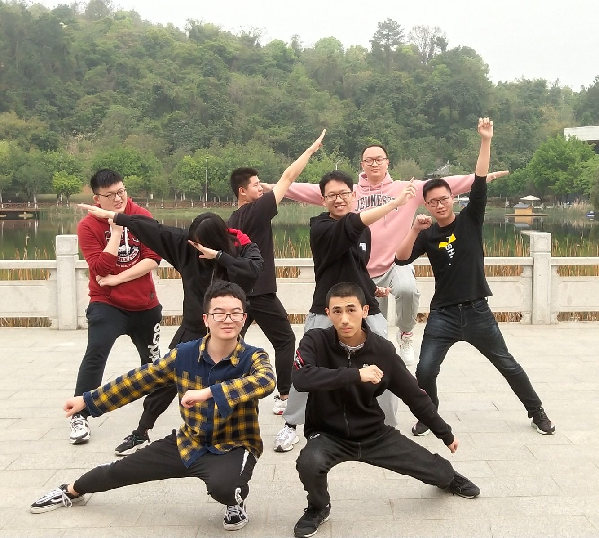

# Concerto 团队展示
|这个作业属于哪个课程|[课程](https://edu.cnblogs.com/campus/fzu/2021SpringSoftwareEngineeringPractice)|
|---	|---	|
|这个作业要求在哪里|[作业要求]()|
|这个作业的目标|团队展示，确定选题|

## 队名
> Concerto
> 

## 团队项目描述
> 针对小团队快速启动的协助辅助工具
> 

## 队员风采
> **学号** 221801317
> 
> **成员昵称**  sarise
> 
> **成员博客园地址**  https://www.cnblogs.com/sariseBlog/
> 
> **成员性格**  淡定
> 
> **擅长的技术** java后端
> 
> **兴趣爱好**   咖啡 小提琴
> 
> **希望的软工角色** 后端 PM
> 
> **一句slogan**   笑就好了 :D

> **学号** 081700318
> 
> **成员昵称**  aaagx
> 
> **成员博客园地址**   https://www.cnblogs.com/aaagx/
> 
> **成员性格**  开朗活泼
> 
> **擅长的技术**  安卓开发 
> 
> **兴趣爱好**   打电动
> 
> **希望的软工角色** 前端 测试
> 
> **一句slogan**   摇了我吧

> **学号** 021800713
> 
> **成员昵称**  Kroos
> 
> **成员博客园地址**  https://www.cnblogs.com/LINX666
> 
> **成员性格**  不温不火
> 
> **擅长的技术** 貌似没有很擅长的
> 
> **兴趣爱好**   足球、电影
> 
> **希望的软工角色** 前端、后端
> 
> **一句slogan**   俺只是一个搬运工

> **学号** 221801322
> 
> **成员昵称**  笑颜一等赏
> 
> **成员博客园地址**  https://www.cnblogs.com/caihan/
> 
> **成员性格**  慢热
> 
> **擅长的技术** Web
> 
> **兴趣爱好**   动漫、游戏
> 
> **希望的软工角色** 前端
> 
> **一句slogan**   我的精神世界决不能被蚀成废铁

> **学号** 221801431
> 
> **成员昵称**  Letoo
> 
> **成员博客园地址**  https://www.cnblogs.com/LetooJ/
> 
> **成员性格**  自闭
> 
> **擅长的技术** java后端
> 
> **兴趣爱好**   听音乐、发呆、乱画
> 
> **希望的软工角色** 后端、测试
> 
> **一句slogan**   呜啦啦啦啦啦啦啦！
> 

> **学号** 021800623
> 
> **成员昵称**  SiO2
> 
> **成员博客园地址**  https://www.cnblogs.com/fzu-wmz/
> 
> **成员性格**  沉默
> 
> **擅长的技术** 暂无
> 
> **兴趣爱好**   动漫
> 
> **希望的软工角色** 后端
> 
> **一句slogan**   勇敢地去追求月亮吧，就算失败也会落入群星之间。
> 

> **学号** 081800330
> 
> **成员昵称**  EdmundzzZ
> 
> **成员博客园地址**  https://www.cnblogs.com/EdmunddzzzzzZ/
> 
> **成员性格**  哦？
> 
> **擅长的技术** IOS前端 PC逆向
> 
> **兴趣爱好**   看会书
> 
> **希望的软工角色** ios前端
> 
> **一句slogan**  祝你今天愉快，你明天的愉快留着我明天再祝
> 

> **学号** 221600234
> 
> **成员昵称**  李子李子李
> 
> **成员博客园地址**  https://www.cnblogs.com/reborn-Li/
> 
> **成员性格**  不温不火、慢热、与人熟络之后会很热情
> 
> **擅长的技术** 无
> 
> **兴趣爱好**   烹饪（2021年给家里人做了一次年夜饭）
> 
> **希望的软工角色** 后端、测试
> 
> **一句slogan**   希望能成为一个温柔的人
> 

## 团队合照

## 绩效考核方案
考虑到我们相比于业务团队，本质上更趋近于一个学习团队，所以我们的团队一方面会把完成的指标作为硬标准来进行考量，另一方面会通过成员的在项目中得到的进步来作为绩效的一部分，具体方案如下：
> 客观分50% + 主观分50%
> 
> 客观分：分配到的任务完成度40% + 出勤10% 
> 
> 说明：能完成自己的任务就可以得到40%的分数，如果能力有限，但是积极提问讨论，可以加分 封顶40%
> 
> 主观分：[任务难度50%]+[帮助其他成员40%]+[ 学习进展20%]
> 
> 说明：主观分三项累加，满分50%
> 任务难度与工作量和逻辑复杂程度相关，由组长和相应开发部分的小组长进行决定，其他成员可以提出建议。
> 
> 帮助其他成员解决问题，主要是考察小组长对成员问题的解答情况。因为人数多的小组，组长的开发任务更主要的是解决成员的问题。
> 
> 成员完成任务可以整理自己的学习进展报告，内容主要包括：学会的技术，解决的问题，有什么新的想法。 只需要简短，能说清楚就可以。
> 

另外我们小组进行了严格的模块划分，成员可以选择参与自己感兴趣的部分，若是成员感兴趣的部分不在某个考核的范围内，该成员无需参与谈论，获取85%的分数

## 团队愿景
项目实现程度 初衷 对团队的期望
现在有已经有了很多优秀的桌面端协同办公工具，也有很多办公工具有开发了相应的手机端，但是他们实际的使用体验以及产品设计往往都会按照桌面端的思路来进行，并没有利用手机端的特性来进行设计。我们希望做出更加轻量化，更加便利高效的协同工具。
我们希望项目可以完成基础模块的开发，后面如果有新的想法可以继续增加新的模块。
希望团队的成员可以投入到项目中，学习到自己所感兴趣的知识，一起实践，共同进步。

